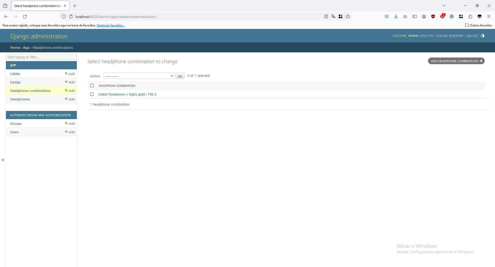

RKA Headphones
==============

# Description

This is a project to practice Django.

This application manages a headphones / IEMs collection. It's possible to save headphones, cables and eartips to
the database. It's also possible to save a combination of headphone / cable / eartip that have a good synergy.

# Screenshots

## REST API

## Admin

